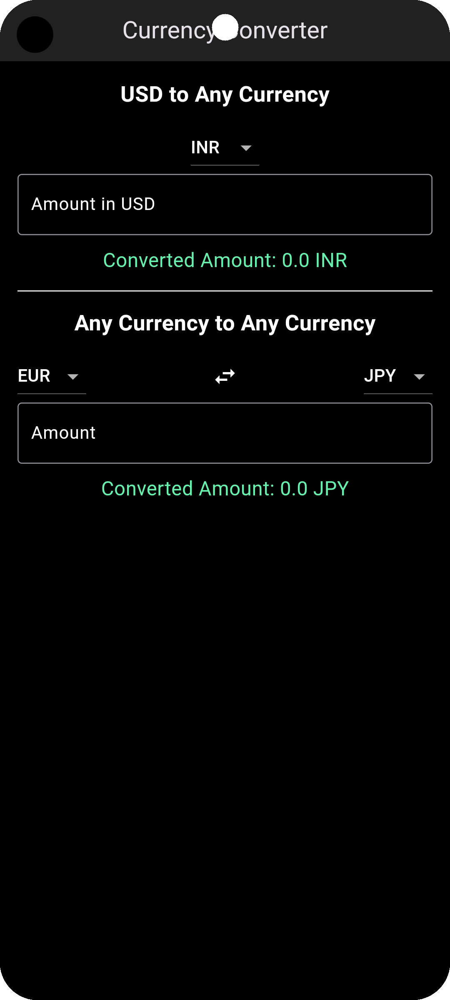
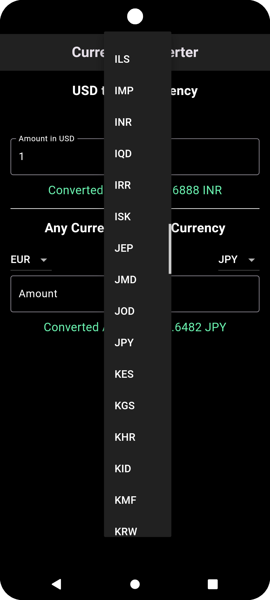
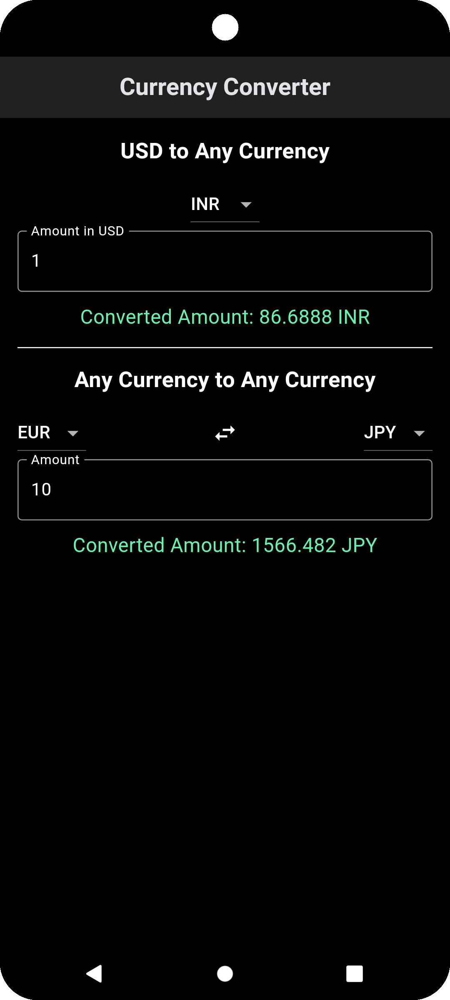

# 💱 Currency Converter 🌍
A simple and efficient **Flutter Currency Converter App** that allows users to convert currencies in real time using an API.

## 📸 Screenshots
 

## 🚀 Features
✅ Real-time currency conversion using an API  
✅ Supports multiple currencies  
✅ Simple and user-friendly UI  
✅ Works on Android & iOS

## 🛠️ Technologies Used
- **Flutter** (Dart)
- **Provider for state management**
- **REST API** for live exchange rates

## ⚙️ Setup & Installation

### 1️⃣ Clone the Repository
```sh
git clone https://github.com/fardhin/flutter_currency_converter.git
cd flutter_currency_converter
```

### 2️⃣ Install Dependencies
```sh
flutter pub get
```

### 3️⃣ Run the App

```sh
flutter run
```  

### 🔗 API Used
##This app fetches real-time exchange rates from ExchangeRateAPI (or any API you are using).

### 🎯 TODO
- **🚀 Improve UI design** 
- **💱 Add more currency options**
- **📶 Implement offline mode** 

### 📄 License
This project is open-source and available under the MIT License.

### 💡 Contribute
Feel free to fork this repo and submit pull requests. Contributions are welcome! 😊
